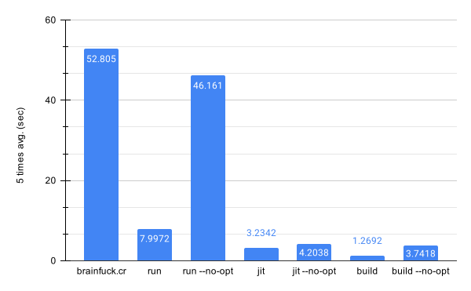

# bfcr

Bfcr is an optimizing interpreter and compiler for Brainfuck.
It is written in Crystal and supports:

- Running Brainfuck programs on the fly in interpreter or JIT mode
- Compiling Brainfuck programs to fully-optimized executables

The compilation is done by LLVM, and it produces very fast machine codes. The interpreter runs slower than compiled programs, but it still does some peephole optimizations and runs measurably faster than other implementations in Crystal.

See [Benchmarks](https://github.com/soya-daizu/bfcr#benchmarks) for the comparison between different modes and implementations.

## Installation

You will need a fairly recent version of LLVM to build bfcr. It is tested to work with LLVM 14.0.6 on macOS 11.6.1. It uses the built-in LLVM bindings included in Crystal's standard library (for the most part), so no additional configuration is needed.

To build the interpreter/compiler, simply clone the repository and build the project as usual.

```shell
$ git clone https://github.com/soya-daizu/bfcr.git
$ cd bfcr
$ shards build --release
```

## Usage

```shell
$ ./bin/bfcr run sample/mandelbrot.bf # Run in interpreter mode
$ ./bin/bfcr run sample/mandelbrot.bf --no-opt # No peephole optimizations

$ ./bin/bfcr jit sample/mandelbrot.bf # Run in JIT mode
$ ./bin/bfcr jit sample/mandelbrot.bf --no-opt # Execute unoptimized IR

$ ./bin/bfcr build sample/mandelbrot.bf # Build executable
$ ./bin/bfcr build sample/mandelbrot.bf --no-opt # Also without optimizations
$ ./out # Built executables are named "out"
```

## Benchmarks

### mandelbrot.bf



*[brainfuck.cr](https://github.com/crystal-lang/crystal/blob/master/samples/brainfuck.cr) can be found at the sample codes in the Crystal repository

`jit` is slightly slower than `jit --no-opt` because optimizations can sometimes take longer than executing unoptimized code.

`build` and `build --no-opt` doesn't include the time it took to compile the program.

## Contributing

1. Fork it (<https://github.com/soya-daizu/bfcr/fork>)
2. Create your feature branch (`git checkout -b my-new-feature`)
3. Commit your changes (`git commit -am 'Add some feature'`)
4. Push to the branch (`git push origin my-new-feature`)
5. Create a new Pull Request

## Contributors

- [soya_daizu](https://github.com/soya-daizu)- creator and maintainer
