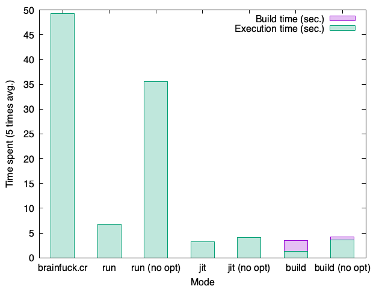
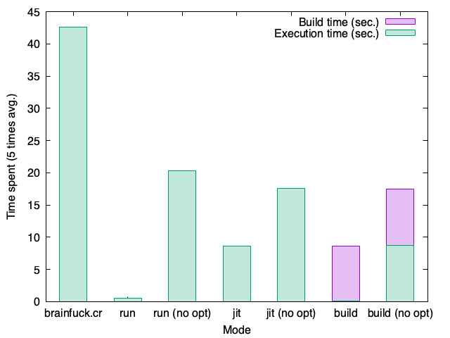

# bfcr

Bfcr is an optimizing interpreter and compiler for Brainfuck.
It is written in Crystal and supports:

- Running Brainfuck programs on the fly in interpreter or JIT mode
- Compiling Brainfuck programs to fully-optimized executables

The compilation is done by LLVM, and it produces very fast machine codes. The interpreter runs slower than compiled programs, but it still does some peephole optimizations and runs measurably faster than other implementations in Crystal.

See [Benchmarks](https://github.com/soya-daizu/bfcr#benchmarks) for the comparison between different modes and implementations.

## Installation

You will need a fairly recent version of LLVM to build bfcr. It is tested to work with LLVM 14.0.6 on macOS 11.6.1. It uses the built-in LLVM bindings included in Crystal's standard library (for the most part), so no additional configuration is needed.

To build the interpreter/compiler, simply clone the repository and build the project as usual.

```shell
$ git clone https://github.com/soya-daizu/bfcr.git
$ cd bfcr
$ shards build bfcr --release
```

## Usage

```shell
# Run all sample programs in every modes available.
# Note that this could take very long (up to 20 mins) depending on your hardware.
$ shards run benchmark

$ ./bin/bfcr run sample/mandelbrot.bf # Run in interpreter mode
$ ./bin/bfcr run sample/mandelbrot.bf --no-opt # No peephole optimizations

$ ./bin/bfcr jit sample/mandelbrot.bf # Run in JIT mode
$ ./bin/bfcr jit sample/mandelbrot.bf --no-opt # No peephole optimizations & no IR optimizations done by LLVM

$ ./bin/bfcr build sample/mandelbrot.bf # Build executable
$ ./bin/bfcr build sample/mandelbrot.bf --no-opt # Also without any optimizations
$ ./out # Built executables are named "out" by default
```

## Benchmarks

\*[brainfuck.cr](https://gist.github.com/soya-daizu/16eed302d7d4d55181f5f5243ef08a50) is a patched version of brainfuck interpreter found in the official Crystal examples. The original source code can be found at: https://github.com/crystal-lang/crystal/blob/master/samples/brainfuck.cr

In general, the `run` mode without optimizations runs the slowest among all the bfcr execution modes, but the interpreter in bfcr makes it still faster than in brainfuck.cr.

The `run` mode with static optimizations usually goes the second, but in some programs, it greatly outperforms the `jit` mode which requires active optimization and almost matches the speed of the binary emitted by the `build` mode. This is mostly due to LLVM taking very long to actively optimize the program before it starts running in the `jit` mode, and although the `run` mode only performs a collection of static optimizations, it is sometimes effective enough to run the program fast.

The `build` mode in general emits the fastest codes to excecute, but as mentioned, the optimizations done by LLVM could make the program very long to compile.

### factor.bf

Used "179424691" as an input

| Mode | brainfuck.cr | run    | run (no opt) | jit    | jit (no opt) | build                        | build (no opt)               |
| ---- | ------------ | ------ | ------------ | ------ | ------------ | ---------------------------- | ---------------------------- |
| Time | 14.635s      | 3.002s | 12.423s      | 0.576s | 1.525s       | 0.251s (+ 0.483s build time) | 1.112s (+ 0.625s build time) |


### mandelbrot.bf

| Mode | brainfuck.cr | run    | run (no opt) | jit    | jit (no opt) | build                        | build (no opt)               |
| ---- | ------------ | ------ | ------------ | ------ | ------------ | ---------------------------- | ---------------------------- |
| Time | 49.216s      | 6.719s | 35.57s       | 3.236s | 4.132s       | 1.265s (+ 2.186s build time) | 3.604s (+ 0.619s build time) |



### hanoi.bf

| Mode | brainfuck.cr | run    | run (no opt) | jit    | jit (no opt) | build                        | build (no opt)               |
| ---- | ------------ | ------ | ------------ | ------ | ------------ | ---------------------------- | ---------------------------- |
| Time | 42.593s      | 0.483s | 20.3s        | 8.576s | 17.608s      | 0.075s (+ 8.508s build time) | 8.769s (+ 8.748s build time) |



## Explanations on the static optimizations

While bfcr make use of LLVM to actively optimize the program in the `jit` and `build` mode, a lot of the improvements in performance is achieved by the static optimizations. Many Brainfuck programs often has certain patterns of instructions to do some common operations (like copying or assigning a value to a cell) that often appears very verbose and takes unneededly long to execute. Bfcr detects those patterns before excecution or compilation and translates them into a single-call instruction.

Below are the static optimizations that are currently implemented in bfcr.

### Deflate repeated instructions into one

```brainfuck
+++++ Translates into Command(@type=IncData, @arg=5)
----- Translates into Command(@type=IncData, @arg=-5)
>>>>> Translates into Command(@type=IncPtr, @arg=5)
<<<<< Translates into Command(@type=IncPtr, @arg=-5)
```

### Detect decrement loops to set the current value to 0

```brainfuck
Decrement (or increment) until the value in the current cell gets to 0
[-] or [+] Translates into Command(@type=Clear)
```

### Detect pointer movements to the next or last empty cell

```brainfuck
Moves pointer by -1 (or 1) until it finds a cell with value 0
[<] Translates into Command(@type=Scan, @arg=-1)
[>] Translates into Command(@type=Scan, @arg=1)
Moves pointer by -3 (or 3) until it finds a cell with value 0
[<<<] Translates into Command(@type=Scan, @arg=-3)
[>>>] Translates into Command(@type=Scan, @arg=3)
```

### Detect moving value to another cell

```brainfuck
Decrement and then increment to the next cell until the value in the first cell gets to 0
[->+<] Translates into Command(@type=Multiply, @arg=1, @arg2=1)
Does the same but to the previous cell
[-<+>] Translates into Command(@type=Multiply, @arg=-1, @arg2=1)
Does the same but to the cell after three
[->>>+<<<] Translates into Command(@type=Multiply, @arg=3, @arg2=1)

@arg is a offset to the destination cell from the original cell 
@arg2 is a multiplier value (which is 1 when moving value)
```

### Detect multiplying value to another cell

```brainfuck
Decrement by 1 and then increment by 3 to the next cell until the value in the first cell gets to 0
[->+++<] Translates into Command(@type=Multiply, @arg=1, @arg2=3)
Does the same but to the previous cell
[-<+++>] Translates into Command(@type=Multiply, @arg=-1, @arg2=3)
Does the same but to the cell after three
[->>>+++<<<] Translates into Command(@type=Multiply, @arg=3, @arg2=3)

@arg is a offset to the destination cell from the original cell 
@arg2 is a multiplier value
```

## Contributing

1. Fork it (<https://github.com/soya-daizu/bfcr/fork>)
2. Create your feature branch (`git checkout -b my-new-feature`)
3. Commit your changes (`git commit -am 'Add some feature'`)
4. Push to the branch (`git push origin my-new-feature`)
5. Create a new Pull Request

## Contributors

- [soya_daizu](https://github.com/soya-daizu) - creator and maintainer
